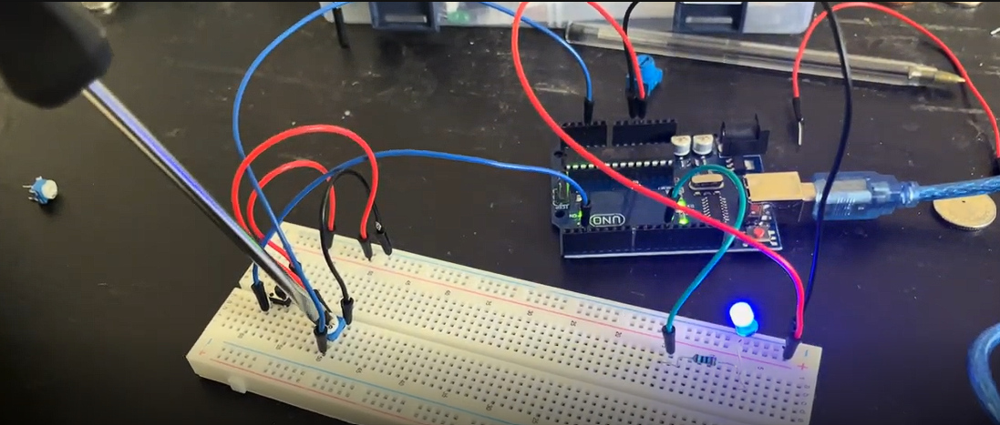

# Potentiometer Circuit to Control light intensity of LED
I added a potentiometer to the circuit. I then connected the front pins to 5V and GND respectively and then connected the front back pin to Analog Input A2. In the code my program reads the ADC reading and then I convert it to a PWM value by dividing it by 4. Finally, I use this new value to set and use analogue write which makes the LED power on as I turn the resistor from a minimum to maximum value,

## Video
Click Thumbnail to see the full Video demonstration

